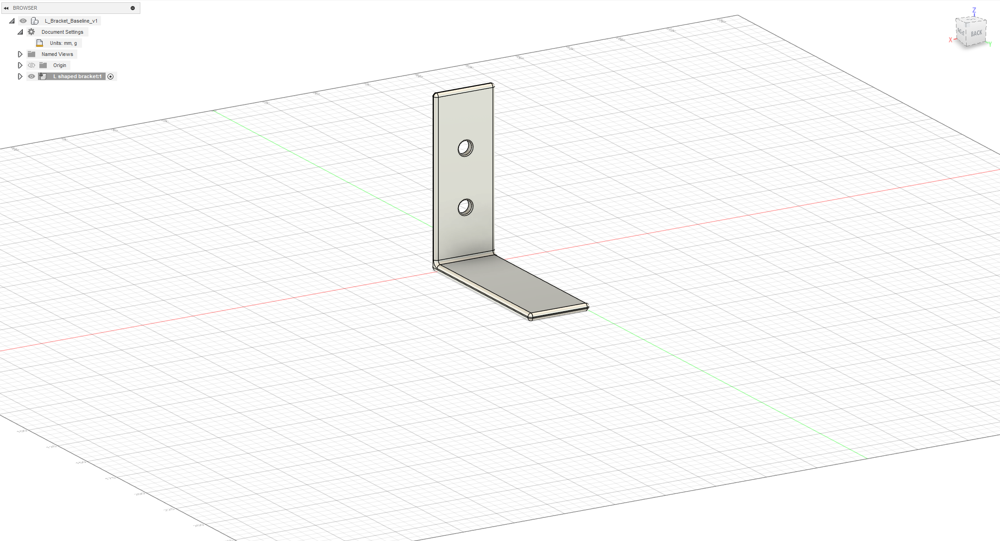

# L-Bracket Design & Static Stress FEA (Autodesk Fusion)

## Overview
This project focuses on the design and structural analysis of an aluminum L-bracket using Autodesk Fusion. The objective was to evaluate structural performance under load and optimize the design while maintaining an acceptable factor of safety.

## Tools Used
- Autodesk Fusion
- Static Stress Finite Element Analysis (FEA)

## Problem Definition
- Material: Aluminum 6061
- Constraint: Fixed mounting face
- Load: 100 N downward force applied to the horizontal leg

## CAD Model

## Stress Analysis (von Mises)

## Safety Factor

## Results
- Maximum von Mises stress: ~77 MPa
- Minimum factor of safety: ~3.5
- Optimized design meets structural requirements while reducing material usage
